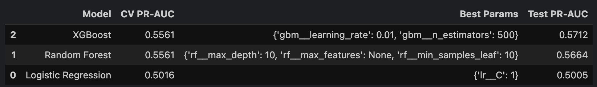
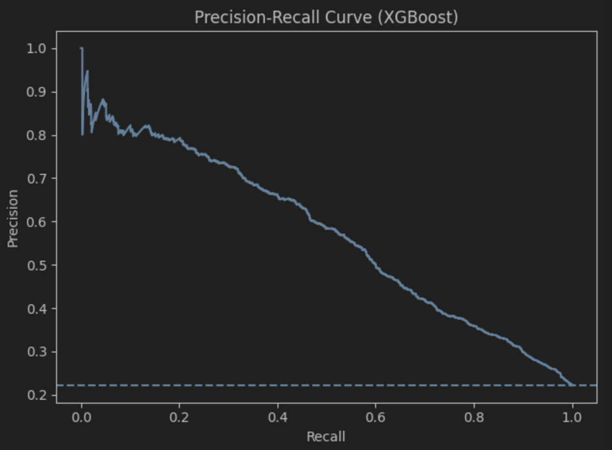
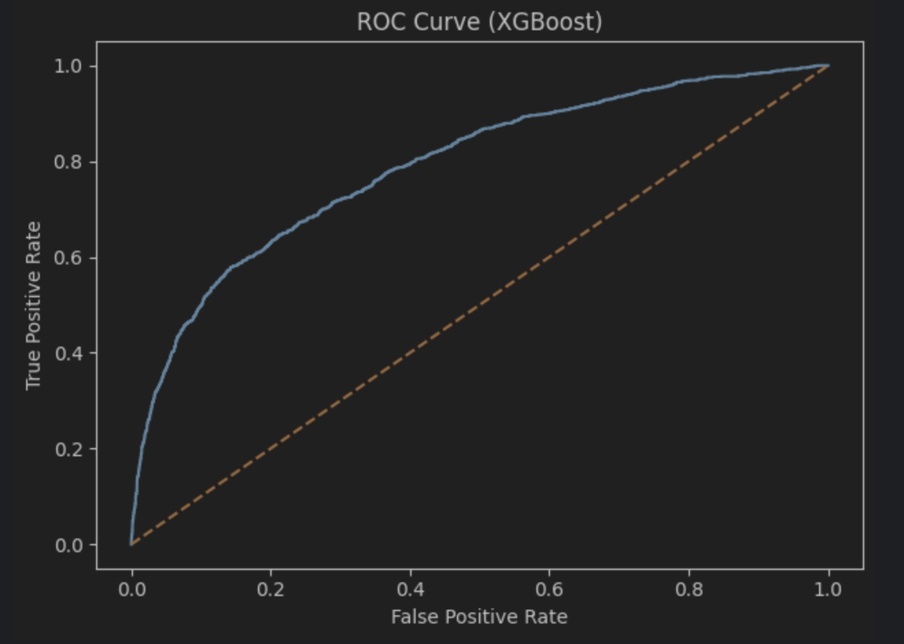
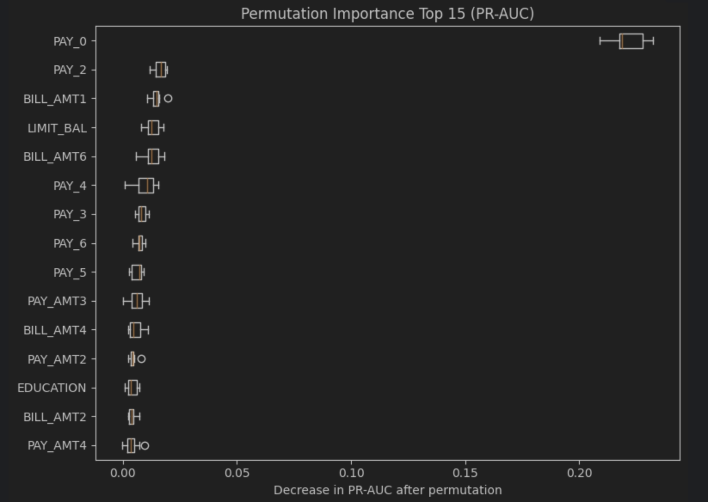

# credit-default-risk-uci

Predict if a customer will default next month.

## Source Dataset
 - University of California Irvine 
 - Yeh, I. (2009). Default of Credit Card Clients [Dataset]. UCI Machine Learning Repository. https://doi.org/10.24432/C55S3H

## Notes to Reader:
- README is kept as a very broad overview, detailed decision-making reasoning and analysis are in the jupyter notebook.
- No missing values. UCI states this and I verified myself.
- Class imbalance is about 22% positive so PR-AUC is used as metric of preference.
  - To handle weighting, I attempted `class_weight` parameter inside scikit-learn models LR and RF (`scale_pos_weight` for XGBoost) and also attempted SMOTE.
- All datatypes straight from UCI dataset are int64. Despite obvious categorical features, I left dtype untouched for simplicity.

## Method
1. Train/Test split: stratified holdout split (test held out for final evaluation only)
2. Model selection: 5-fold stratified cross validation on training set
3. Primary metrics: PR-AUC (Precision Recall Area Under Curve - Average Precision)
    - Baseline PR-AUC for a random classifier on this dataset: 0.22 (positive rate of label)
4. Feature Importance: Analyzed via Permutation Importance on the best model using PR-AUC as the scoring function.

## Results

**Best Model** XGBoost with `scale_pos_weight`

- Imbalance handling was also assessed with SMOTE inside cross-validation 
- For this dataset, weighting with scale_pos_weight outperformed SMOTE
  - SMOTE also selected fewer trees, consistent with earlier overfitting when training on synthetic minority samples
    
## Key Feature Findings
- I used Permutation Importance to assess feature strength for predicting default, see notebook for further details.
- PAY_0 (repayment status in September, the most recent month before assessing "default next month") dominates.

## Plots

